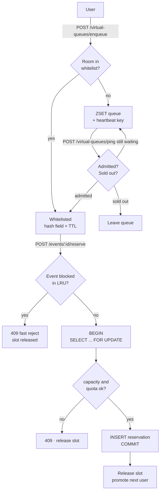

# ticketing-master

A concert seat reservation system built to answer one question with code:

> When 500 concurrent requests hit the same 200-seat venue at the exact moment tickets go on sale, how do you guarantee **zero overselling**, **zero deadlocks**, and **fair ordering** — while keeping p99 latency reasonable?

The answer this repo argues for, and measures:

**Correctness comes from a database row lock. The virtual queue is a latency and throughput dial that cannot affect correctness.** Every admission setting from a gate of 10 to a gate of 3000 sells exactly the capacity and never one seat more.

Go backend, React frontend, Postgres + Redis, and a built-in load generator that drives up to 20,000 concurrent users and streams the results live.

---

## Quickstart

```bash
git clone <this repo> && cd ticketing-master
docker compose up -d --build
```

Then open **http://localhost:5173**.

| service | url | notes |
|---|---|---|
| frontend | http://localhost:5173 | the demo UI |
| backend | http://localhost:8000 | REST API, `DEMO_MODE=true` in compose |
| postgres | localhost:5432 | `postgres` / `secretpassword` |
| redis | localhost:6379 | |

The stack seeds five events on first boot. Pick one, press **RUN SIMULATION**, and watch the invariant hold.

To prove the headline claim in one command instead:

```bash
curl -s -X POST http://localhost:8000/admin/simulate \
  -H 'Content-Type: application/json' \
  -d '{"eventId":"<id from GET /events>","users":20000,"capacity":1000,
       "maxConcurrent":10,"reset":true,"transport":"inproc"}'
```

20,000 users, 1,000 seats, `oversold: false`, every user accounted for.

---

## The measured result

20,000 concurrent users against 1,000 seats, admission gate of 10:

```
wall clock   35.2s
seats sold   1000 / 1000        oversold: false
accounted    20000 / 20000      reaped 0 · timed out 0 · errors 0
reserve p50  3.12ms   p95 31.77ms   p99 113.50ms
```

And the trade-off the gate actually buys — 3,000 users against 3,000 seats, so nobody is rejected and the number means throughput:

| gate | wall clock | reserve p50 | oversold |
|---:|---:|---:|:---:|
| 10 | 14.2s | 2.6ms | no |
| 50 | 4.8s | 25.4ms | no |
| 200 | 4.0s | 200.6ms | no |
| 1000 | 3.7s | 903.0ms | no |
| 3000 | 3.2s | 1281.5ms | no |

The widest gate is **4.4× faster for 500× the latency**, and everything past ~50 is diminishing returns. The `oversold` column never changes, which is the point: the gate is a performance dial, not a safety mechanism.

Full methodology, hardware caveats, and the poll-storm finding are in **[docs/load-testing.md](docs/load-testing.md)**.

---

## How it works



Three mechanisms, each with a distinct job:

**1. The row lock is the invariant.** `ReserveEvent` opens a transaction, takes `SELECT capacity, max_reserve_per_user FROM events WHERE id = $1 FOR UPDATE`, sums active reservations, checks capacity, inserts, and commits. Concurrent reservers for the same event serialize on that one row. This is the only thing preventing overselling, and it would hold with the queue removed entirely.

**2. The virtual queue is admission control.** A Redis ZSET holds queue order, a per-user heartbeat key proves liveness, and a hash with per-field TTLs (`HEXPIRE`, Redis 7.4+) holds the admitted set. A promoter ticker refills the whitelist from the queue. The gate bounds how many users reach the database at once — it changes latency and throughput, never correctness.

**3. A sold-out short-circuit skips the database.** Once an event fills, an LRU marks it blocked so later attempts reject without a transaction. It is invalidated by the expiry sweep, manual release, both reset paths, and capacity changes.

The subtle part is that rejecting fast must not stall the queue: a rejected user still holds an admission slot, so every terminal path releases it and promotes the next user. Missing that turned a 6-second run into a 302-second one during development.

Why a row lock rather than optimistic CAS, a Redis seat lock, or a Kafka partition per event — and why the asynchronous boundary sits at admission rather than at resolution: **[Choosing a contention strategy](docs/architecture.md#choosing-a-contention-strategy)**.

Detail, including the Lua scripts and why each key exists: **[docs/architecture.md](docs/architecture.md)**.

---

## Repository layout

```
backend/
  handler/        HTTP layer (chi) — events, reservations, virtual queues, users, admin
  service/        orchestration — queue guards, idempotency replay, slot release
  repository/     postgres + redis, one package per aggregate
  simulation/     the load generator: engine, transports, run registry
  migrations/     golang-migrate SQL
  cmd/            migrate, seed, simulate (CLI)
frontend/         React 19 + Vite + TypeScript, neo-brutalist demo UI
docs/             architecture, load testing, API reference
```

---

## Documentation

| doc | what's in it |
|---|---|
| [docs/architecture.md](docs/architecture.md) | Schema, the oversell invariant, why this contention strategy over the alternatives, virtual queue internals, failure modes found and fixed |
| [docs/load-testing.md](docs/load-testing.md) | How to run load tests, both transports, every measurement, the poll-storm result |
| [docs/api.md](docs/api.md) | Endpoint reference including the demo-only `/admin` routes |

---

## Configuration

Backend reads from environment (or a `.env` file in `backend/`):

| var | default | meaning |
|---|---|---|
| `PORT` | `8000` | |
| `JWT_SECRET` | — | **required** |
| `POSTGRESQL_URL` | — | **required** |
| `REDIS_URL` | — | **required**, bare `host:port` (not a `redis://` URL) |
| `DEMO_MODE` | `false` | registers the `/admin` routes the demo UI needs |
| `MAX_CONCURRENT_QUEUE` | `10` | global admission gate, overridable per event |
| `WHITELIST_TTL` | `15m` | how long an admission slot survives unused |
| `HEARTBEAT_TTL` | `5m` | how long a queued user survives without polling |
| `QUEUE_TTL` | `5m` | queue entry expiry |
| `PROMOTE_INTERVAL` | `1s` | promoter ticker period |

`DEMO_MODE` gates `/admin/mint`, `/admin/reset` and `/admin/simulate`. These reset databases and flush Redis — **never enable it on anything public.**

---

## Requirements

- Docker (compose v2) — the only requirement for the quickstart
- Go **1.26+** (`go.mod`) and Node **20+** (Vite 8) if running outside containers
- **Redis 7.4+** — the whitelist depends on hash-field TTLs (`HEXPIRE`/`HTTL`), so older Redis will fail at runtime, not at startup

Compose declares all environment inline, so no `.env` file is needed for the quickstart. Running the backend directly does need one — see `backend/.env.example`.
