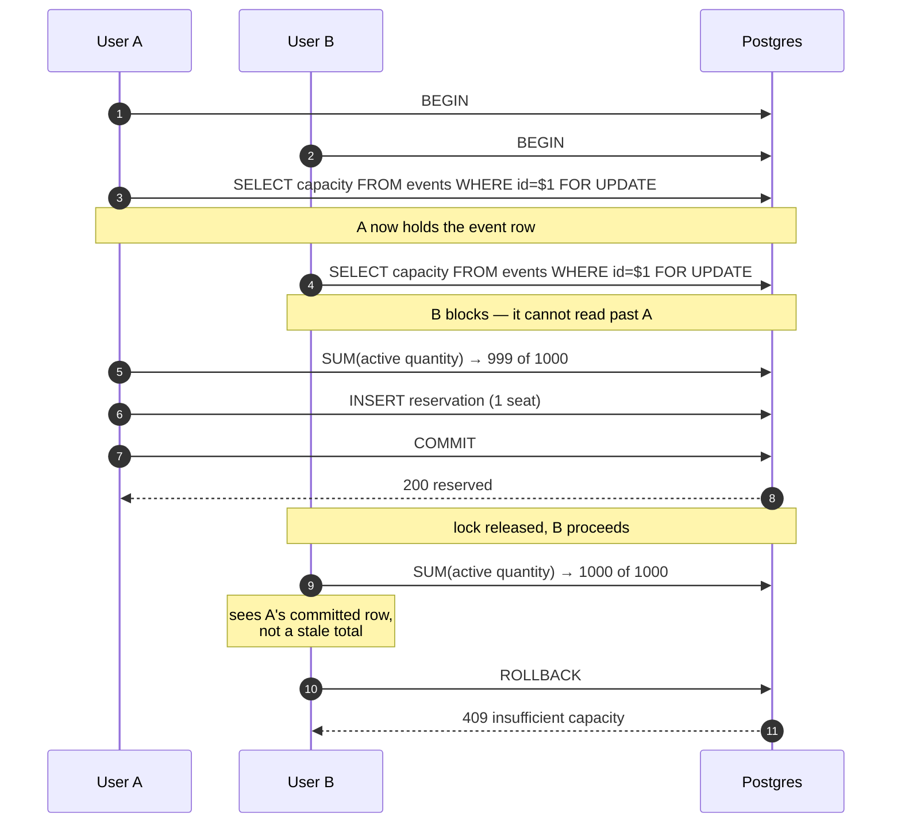
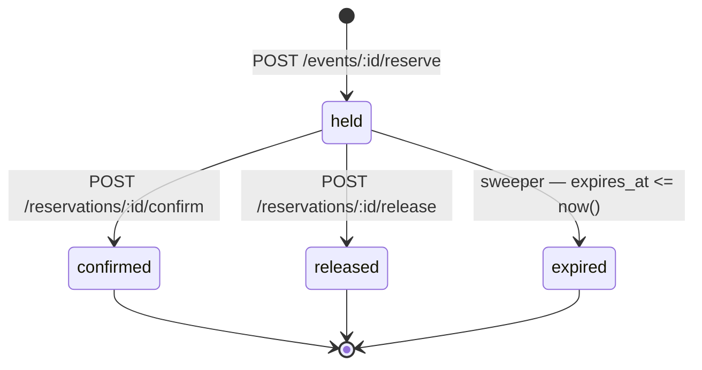
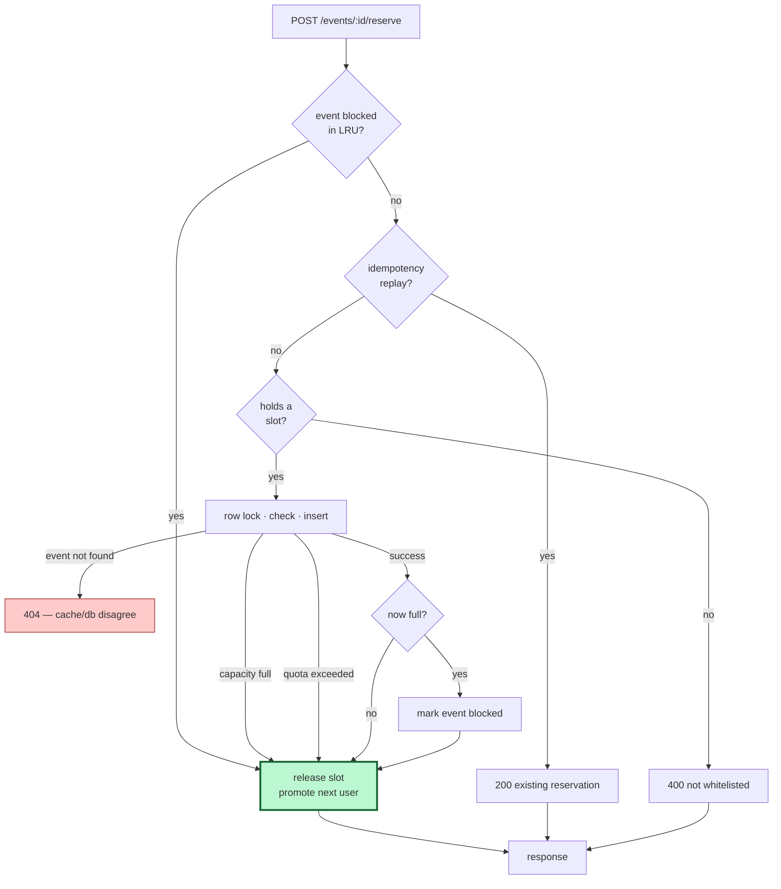

# Architecture

How reservation works, why each piece exists, and what broke along the way.

The organising claim: **the row lock is the invariant; everything else is performance.** Read that first, because it explains why the queue is allowed to be lossy, why the LRU is allowed to be stale, and why neither can oversell.

---

## Schema

Three tables. `migrations/` holds the golang-migrate SQL.

```sql
events
  id, name, capacity, max_reserve_per_user,
  start_sales_at, created_at, updated_at, deleted_at

reservations
  id, event_id, user_id, quantity,
  status TEXT CHECK (status IN ('held','confirmed','released','expired')),
  idempotency_key, reserved_at, expires_at,
  confirmed_at, released_at, created_at, updated_at
```

Indexes that matter under load:

| index | why |
|---|---|
| `reservations (event_id, status)` | the oversell check sums active reservations per event |
| `reservations (expires_at) WHERE status = 'held'` | the sweeper finds expired holds without scanning confirmed rows |
| `reservations (event_id, user_id, idempotency_key) UNIQUE` | idempotency scoped per user, see below |
| `events (id) WHERE deleted_at IS NULL` | soft-deleted events stay out of hot lookups |

Events are **soft-deleted**. Nothing hard-deletes an event, which is why the reserve path treats "event not found" as a genuine anomaly rather than a routine race.

### Idempotency is scoped, deliberately

Migration `000006` moved the unique index from `(idempotency_key)` to `(event_id, user_id, idempotency_key)`. A global index had two problems: one user's key could collide with another's, and since reserve *replays* an existing reservation for a known key, a global index would let a caller read someone else's reservation by guessing a key. Scoping makes a key meaningful only inside its own event and user.

A replay is served from Redis when available (`reservationItemTTL`, 60s) and from Postgres otherwise. The cached copy is written at reserve time and is not refreshed when the reservation is later confirmed or released, so a replay within that window can report `"status": "held"` for a reservation that has already moved on. The id and quantity — the parts a retrying client is actually asking about — are always correct, and the entry self-heals at TTL. Nothing else reads it: confirm's own replay check deliberately goes to Postgres, precisely so its answer cannot depend on cache age.

---

## The oversell invariant

All of it lives in `ReserveEvent` (`repository/reservations/postgresReservationRepository.go`):

```sql
BEGIN;
SELECT capacity, max_reserve_per_user FROM events WHERE id = $1 FOR UPDATE;
SELECT COALESCE(SUM(quantity), 0),
       COALESCE(SUM(quantity) FILTER (WHERE user_id = $4), 0)
  FROM reservations
 WHERE event_id = $1
   AND ((status = 'held' AND expires_at > now()) OR status = 'confirmed');
-- capacity and per-user quota checks
INSERT INTO reservations (...);
COMMIT;
```

`FOR UPDATE` on the **event** row is the serialization point. Concurrent reservers for one event queue on that row; reservers for different events never contend. The sum and the insert are inside the same transaction as the lock, so no one can read a stale total and write past capacity.

This is pessimistic locking. It was chosen over the optimistic `UPDATE ... WHERE status='available'` loop because seats here are a *count*, not individually-tracked rows — there is no per-seat row to compare-and-swap, and a retry loop against an aggregate degrades badly exactly when contention is highest.

### Why `isCapped` is separate from the error

`ReserveEvent` returns `(reservation, isCapped, error)`. `isCapped` answers "is this event now full?" — an observation about the *event*, independent of what happened to *this caller*. It took two wrong attempts to get right:

- Pre-insert it is `dbActiveReserved >= dbCapacity`, returned on **every** rejection path. A user who exceeded their personal quota still observed a true fact about the event, and a user who asked for 3 seats when 1 remained was rejected without the event being full.
- Post-**commit** it is `dbActiveReserved + quantity >= dbCapacity`, because only after a durable commit can you claim the seats are actually taken.

Computing it post-commit rather than pre-insert matters: a rolled-back transaction must not mark an event sold out.

---

## The virtual queue

Three Redis structures per event, all sharing a `{eventId}` hash tag so they land on one Cluster slot and can be manipulated atomically in one Lua script:

| key | type | role |
|---|---|---|
| `virtual_queue:{event}:event` | ZSET | queue order, scored by expiry |
| `virtual_queue:{event}:user:<id>` | string + TTL | heartbeat — proves the client is alive |
| `virtual_queue:{event}:whitelist` | hash + per-field TTL | the admitted set |
| `virtual_queue:{event}:max_concurrent` | string | per-event gate override |
| `virtual_queue:active_events` | set | which events the promoter should scan |

**Order and liveness are separate on purpose.** An earlier design scored the ZSET by heartbeat and used `ZREMRANGEBYSCORE` to evict — which also evicted users who were still waiting patiently, because a stale score and an absent user are indistinguishable when one field encodes both. Splitting them means the ZSET answers "who is next" and the heartbeat key answers "are they still there".

The whitelist uses a **hash with per-field TTLs** (`HEXPIRE`, Redis 7.4+) rather than one key per admitted user. One key per user meant `HLEN`-equivalent counting required a scan; a hash gives O(1) occupancy against the gate, which is checked on every promotion.

### Admission

`tryWhitelistEventQueueLuaScript` computes `room = maxConcurrency - HLEN(whitelist)`, scans the front of the ZSET in batches, skips members whose heartbeat has vanished, and promotes the live ones — removing every candidate it inspects from the ZSET either way.

That last detail is why the script has **no offset**: an early version advanced `offset += batchSize` between batches, but since every scanned candidate is removed, advancing skipped live members that had shifted into the window.

Admission happens from two directions: a **promoter ticker** (`PROMOTE_INTERVAL`, default 1s) sweeping active events, and an **inline promotion** each time a slot is released. The ticker alone would cap throughput at one batch per tick.

### Polling

`POST /virtual-queues/ping` is a single Lua script that answers "am I admitted?" **and** refreshes the heartbeat, because a client that is asking is by definition alive:

```lua
local ttl = redis.call("HTTL", eventWhitelistKey, "FIELDS", 1, userId)
if ttl and ttl[1] and tonumber(ttl[1]) > 0 then
    return tonumber(ttl[1])          -- admitted, with remaining slot TTL
end
if redis.call("EXPIRE", userHeartbeatKey, heartbeatTTL) == 1 then
    return 0                         -- still queued, heartbeat refreshed
end
return -1                            -- reaped or never queued
```

These were originally two endpoints. Splitting them doubled Redis load for no information gain and starved runs at high user counts — the load generator's polls crowded out the reserve path. See [load-testing.md](load-testing.md#the-poll-storm) for what that costs.

The response also carries `soldOut`, so a waiting client stops polling for a turn that can only deliver a rejection.

---

## The sold-out short-circuit

Once an event fills, `BlockEvent` marks it in a process-local LRU (`hashicorp/golang-lru/v2`, 128 entries). Subsequent reserves reject without opening a transaction.

It is a **cache of a fact the database owns**, so every path that makes the fact false must invalidate it:

| path | trigger |
|---|---|
| `RefreshEventStatus` | expiry sweep frees held seats |
| `ReleaseReservation` | a hold is manually released |
| `/admin/reset` | rows truncated |
| `/admin/simulate` with `reset: true` | rows deleted inline |
| `/admin/simulate` with `capacity > 0` | a full event gains seats |

Five paths, none co-located, and the failure mode is silent — a stale block makes an empty event reject everything at `p50 = 0.00ms`, which reads as a *feature*. A regression run caught exactly this: the simulate reset path was missing, so runs 2 through 4 sold zero seats while looking fast.

The scale-out fix is a Redis flag per event with a TTL, which expires on its own instead of relying on every future writer remembering to invalidate. Not needed for a single process.

---

## Releasing the slot

The rule that took the longest to get right:

> **Every terminal path must release the admission slot and promote the next user.**

A rejected user still occupies a whitelist slot. If reserve returns early without releasing it, the slot stays occupied until its TTL expires — and since the event is sold out, every subsequent user hits the same wall. The queue wedges.

This bug was introduced twice. Once when a failed reserve returned before the release, and again when the blocked-event fast path was added and skipped it. The second time cost 302.7 seconds against a 6.0 second baseline.

`releaseQueueSlot` is therefore called on: success, insufficient capacity, quota exceeded, and the blocked-event fast path.

It is deliberately **not** called for `ErrEventNotFound`. Events are soft-deleted, so that error means cache and database disagree — an anomaly where releasing a slot helps nobody.

### Dequeue promotes only when a slot was freed

`Dequeue` returns two booleans: whether the caller was removed at all, and whether that removal freed a *whitelist* slot. Only the second triggers promotion. A user abandoning the queue while still waiting never held a slot, so promoting for them is a Redis script run that cannot admit anyone — at 19,000 abandoning users on a sold-out event, that is 19,000 wasted round trips.

---

## Background workers

| worker | period | job |
|---|---|---|
| promoter | `PROMOTE_INTERVAL` (1s) | refill whitelists for active events |
| expiry sweep | 1 min | `held` + `expires_at <= now()` → `expired`, unblock affected events |

The sweep uses a CTE so one statement both expires holds and reports which events were touched:

```sql
WITH expired AS (
    UPDATE reservations SET status = 'expired', released_at = now()
    WHERE status = 'held' AND expires_at <= now()
    RETURNING event_id
)
SELECT event_id, count(*) FROM expired GROUP BY event_id;
```

Without the returned ids there is no way to know which LRU entries to clear, and an event whose holds all expired would stay blocked until something else invalidated it.

The sweep takes a Redis lock (`LockRefreshEventStatus`) so replicas do not duplicate the work.

---

## How two concurrent reservers resolve

The whole oversell argument in one picture. Both users are admitted, both want the last seat, and neither the queue nor the application decides who wins — Postgres does, by making them take turns on one row.



Step 7 is the one that matters: B's `SUM` runs *after* A committed, so B cannot read a total that ignores A's seat. Move the sum outside the lock and the invariant is gone.

This also answers "why no deadlock": every reserver takes exactly one lock, on the same row, in the same order. There is no second resource to acquire, so there is no cycle to deadlock on.

---

## Reservation lifecycle



Only `held` (with `expires_at > now()`) and `confirmed` count toward capacity. That single rule is why an expired hold frees its seats without any explicit "return the seats" step — the capacity sum simply stops counting it.

The transitions out of `held` are guarded in SQL (`WHERE status = 'held' AND expires_at > now()`), so a confirm racing the sweeper cannot resurrect an expired hold.

That guard is also what makes confirm **replay-idempotent**. A second confirm matches no `held` row, so the service re-reads the reservation: if it is already `confirmed` and owned by the caller, the retry is a replay and returns success. Every other reason for the miss — missing, expired, released, or someone else's — still fails.

```go
err := repo.ConfirmReservation(ctx, userId, reservationId)
if errors.Is(err, ErrReservationNotFound) {
    if res, e := repo.GetReservation(ctx, reservationId); e == nil &&
        res.UserId == userId && res.Status == StatusConfirmed {
        return nil
    }
}
return err
```

Two details carry the weight. The owner comparison keeps `400` uniform across "missing", "not yours" and "already confirmed by someone else", so the endpoint cannot be used to probe for reservation ids. And the re-read goes to Postgres rather than the idempotency cache, which lags the row by up to its 60-second TTL — reading the cache here would make the response depend on cache age rather than on state.

An earlier attempt keyed this on an idempotency key instead. It could not work: the only key storage belongs to *reserve*, so the lookup answered "did a reserve use this key?", which says nothing about whether a confirm already happened. Since the reservation id is in the path, there is no second parameter that a key could contradict — a repeat is unambiguously the same operation, and needs no key to prove it.

---

## The admission-slot invariant

Every path out of reserve must release the slot. This is the rule that broke twice, and the diagram exists so the next person adding a branch sees what they are joining.



Two paths deliberately bypass the release:

- **`400 not whitelisted`** — the caller never had a slot, so there is nothing to release.
- **`404 event not found`** — events are soft-deleted, so this means cache and database disagree. Releasing a slot cannot help, and pretending it is routine would hide a real anomaly.

Everything else converges on the green node. A branch that returns without passing through it wedges the queue for every user behind it.

---

## Not built

- **A second contention strategy.** This implements pessimistic row locking plus Redis admission control, and benchmarks it across admission settings and transports. Serializing each event's reservations through a single log partition (Kafka) would resolve contention by architecture rather than by locking — no lock, one consumer, strict order. Benchmarking that against the row lock is the most interesting piece still missing, because the two fail in different ways: the row lock degrades with contention, the log degrades with partition throughput.
